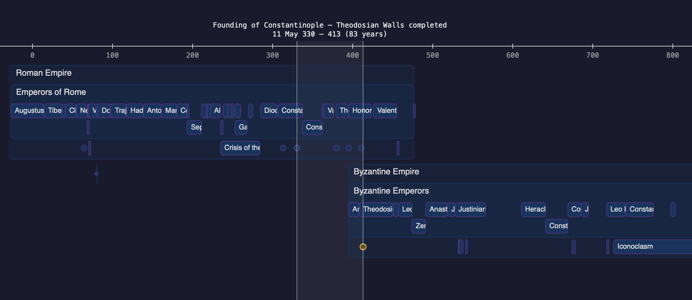

# Timeline

Timeline is a tool to visualise historical timeframes and events.

The purpose of this project is two-fold. First, to create a tool for personal use, learning the scale of historical events, and to be able to present historical data in meaningful ways. Second, to learn to use LLM agent tools when developing software projects.

## Features

Current features include

- Zoomable and scrollable timeline
- Use static file for event data
- Point events, ranged events, and events with not certain beginnning or end dates
- Ongoing events with no known end date
- Additional event info shown in a tooltip bubble
- Nested structure for organising events
- Selection range to highlight time ranges and quickly show distances between events

## Development

Documentation-first development practice. The LLM tool is used to write and maintain documentation before implementing new features. Documentation is more meant for the LLM agent than for human readers.

## License

This codebase is released under the MIT License.
