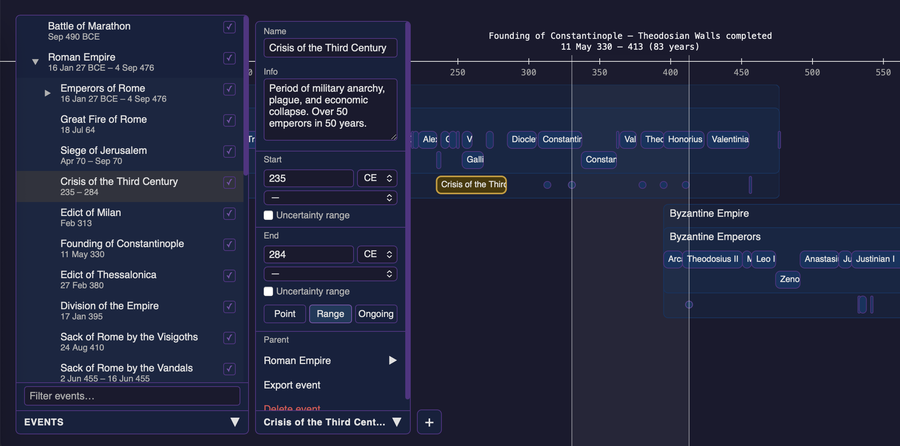
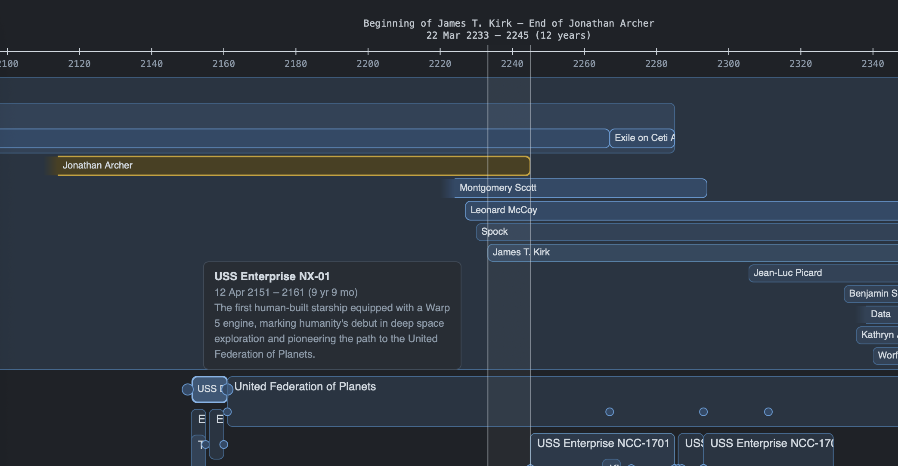
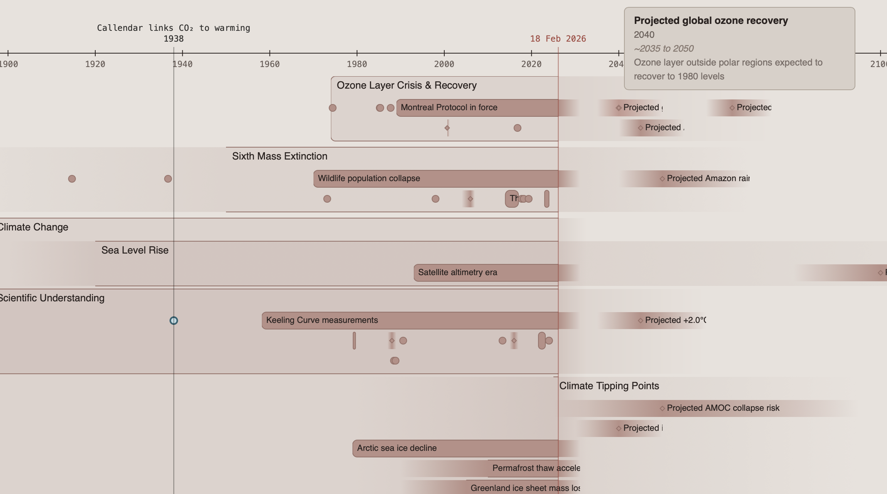

# Timeline

Timeline is a tool to visualise historical timeframes and events, and their relations. Events can be added and customised for different needs, for example learning history, investigating timeframes, matching lives in a family tree to historical events, visualising fictional timelines, designing story timelines, etc.

## Examples

Important events in the Roman Empire and the Eastern Roman Empire



Examining relations of different events in a TV and movie series. This data is available in `public/star_trek_events.json`.



Visualising the timelines of different global crises. This data is available in `public/global_disasters.json`.



Note that this tool is not meant for project planning or to be used as a Gantt chart tool. The main purpose is to be useful for personal history learning and for fictional story development and worldbuilding.

## Features

Current features include

- Zoomable and scrollable timeline
- Add, edit, and remove events, set default events per deployment
- Point events, ranged events, and events with no certain beginnning or end dates
- Ongoing events with no known end date
- Additional event info shown in a tooltip bubble
- Nested structure for organising events
- Hide, collapse, and reorder events
- Selection range to highlight time ranges and quickly show distances between events
- Undo and redo
- Export and import event data as `.json` files
- Persist state in browser using IndexedDB

## Setup

The default events are loaded from `public/events.json`. After initial load, the browser uses local state and does not reload from the file unless default events are reloaded by the user.

If `events.json` is not found, the application uses `events.example.json` as a fallback. Any json file in the `public` directory can be used as the initial `events.json`.

## Running

Requires [Node.js](https://nodejs.org/) and [pnpm](https://pnpm.io/). Dependencies have been kept at minimum.

To start a local development server:

```sh
pnpm install
pnpm dev
```

To build for production:

```sh
pnpm build
pnpm preview
```

## Development

Documentation-first development practice. The LLM tool is used to write and maintain documentation before implementing new features. Documentation is more meant for the LLM agent than for human readers.

## Contributing

All contributions welcome. If you end up testing the project, bugs and suggestions can be added to GitHub Issues.

## License

This codebase is released under the MIT License.
